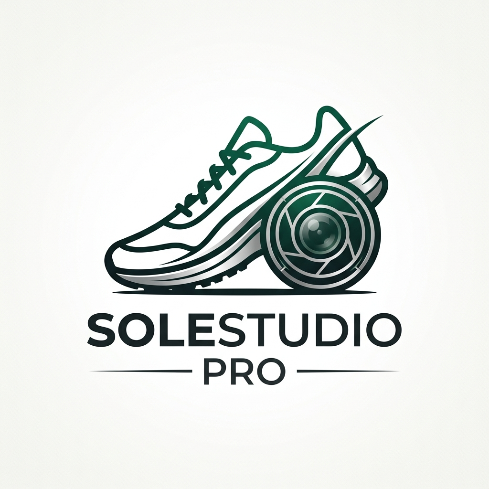
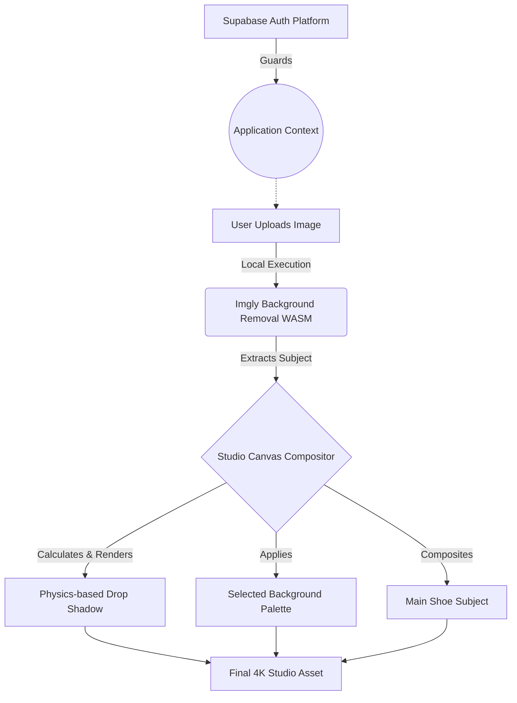

[](https://github.com/Yassiinee/sole-studio/blob/main/LICENSE)
[](https://github.com/Yassiinee/sole-studio/issues)
[](https://www.typescriptlang.org/)
[](https://react.dev/)

<div align="center">
  
  <h1>SoleStudio Pro 👟</h1>
  <p><strong>Professional 4K Studio Renderings from Amateur Shoe Photos</strong></p>
</div>

**SoleStudio Pro** is an advanced AI-driven application designed to transform amateur shoe photos into professional, studio-quality product shots directly from your browser.

By unifying **in-browser WebAssembly AI** and **smart HTML5 Canvas compositing**, SoleStudio Pro processes your footwear images into 4K e-commerce assets with precise textures, realistic shadows, and pristine studio backdrops in seconds—all locally and securely.

---

## ✨ Features

- **Exact Pixel Preservation:** Unlike text-to-image AI, SoleStudio Pro preserves 100% of your original shoe details, textures, and laces.
- **AI Background Segmentation:** Uses powerful WebAssembly (WASM) models to seamlessly strip messy backgrounds in seconds.
- **Studio Compositing:** Automatically calculates optimal padding and renders a flawless `#E8E8E8` grey gradient paper sweep background.
- **Physics-based Shadows:** Generates soft, realistic drop shadows automatically anchored beneath your shoe cutout.
- **Instant Export:** Download razor-sharp 4K digital assets locally.

* **Vite Proxy Magic**: Zero CORS issues—the UI automatically proxies API calls through the Vite development server to safely connect with external services.
* **High-Res Downloads**: Instantly save your 1024x1024 studio shots locally with one click.
* **Refined UI/UX**: A sleek, minimal browser canvas built with React, Vite, and smooth Framer Motion aesthetics.

---

## 🏗️ Architecture & Technology Stack

SoleStudio acts as the master conductor between ultra-fast inference engines and local user workflows:

### Architecture Flow



### Tech Stack

-\* **Frontend:** React 19, TypeScript, Vite

- **Styling:** Tailwind CSS v4, Framer Motion (dynamic routing animations)
- **Auth:** Supabase Auth (Custom UI & Context Guards)
- **Core Image Pipeline:**
  - `@imgly/background-removal` (WASM Browser Inference)
  - HTML `<canvas>` 2D Context Compositing

---

## 🚀 Getting Started

To run SoleStudio Pro, you will need two free access tokens. Follow the instructions carefully to set up your environment.

### 1. Prerequisites

- [Node.js](https://nodejs.org/) (LTS version recommended)
- **Supabase Account**: You will need a standard Supabase project to handle user authentication. Obtain your Project URL and Anon Key from the Supabase dashboard.

### 2. Installation

1. **Clone the repository**:

   ```bash
   git clone https://github.com/Yassiinee/sole-studio.git
   cd sole-studio
   ```

2. **Install dependencies**:

   ```bash
   npm install
   ```

3. **Environment Setup**:
   Create a `.env` file at the root of the project by copying the example:

   ```bash
   cp .env.example .env
   ```

   Add your keys to the `.env` file:

   ```env
   VITE_SUPABASE_URL=https://your-project.supabase.co
   VITE_SUPABASE_ANON_KEY=eyJh...
   ```

4. **Launch the Application**:

   ```bash
   npm run dev
   ```

5. **Start Creating**:
   Open the port provided by vite (usually `http://localhost:5173`). Upload a shoe photo and generate!

---

## 📄 License

This project is open-source and licensed under the **Apache-2.0 License**.

## Author

**Yassine Zakhama** — [zakhamayassine@gmail.com
](mailto:zakhamayassine@gmail.com)
